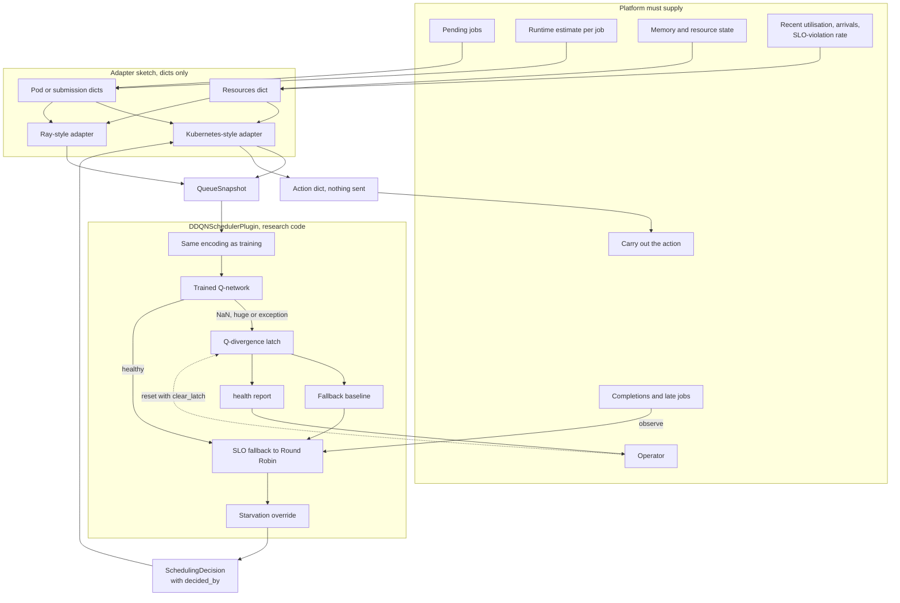

```mermaid
flowchart TD
    subgraph PLAT["Platform must supply"]
        Jobs["Pending jobs"]
        Est["Runtime estimate per job"]
        Res["Memory and resource state"]
        Recent["Recent utilisation, arrivals,<br/>SLO-violation rate"]
        Done["Completions and late jobs"]
        Act["Carry out the action"]
        Op["Operator"]
    end

    subgraph ADAPT["Adapter sketch, dicts only"]
        PDicts["Pod or submission dicts"]
        RDict["Resources dict"]
        K8s["Kubernetes-style adapter"]
        RayA["Ray-style adapter"]
    end

    Snap["QueueSnapshot"]

    subgraph PLUG["DDQNSchedulerPlugin, research code"]
        Enc["Same encoding as training"]
        QNet["Trained Q-network"]
        Latch["Q-divergence latch"]
        Fallback["Fallback baseline"]
        SLO["SLO fallback to Round Robin"]
        Starve["Starvation override"]
        Health["health report"]
    end

    Dec["SchedulingDecision<br/>with decided_by"]
    ActDict["Action dict, nothing sent"]

    Jobs --> PDicts
    Est --> PDicts
    Res --> RDict
    Recent --> RDict
    PDicts --> K8s
    PDicts --> RayA
    RDict --> K8s
    RDict --> RayA
    K8s --> Snap
    RayA --> Snap
    Snap --> Enc
    Enc --> QNet
    QNet -->|"NaN, huge or exception"| Latch
    Latch --> Fallback
    QNet -->|"healthy"| SLO
    Fallback --> SLO
    SLO --> Starve
    Starve --> Dec
    Dec --> K8s
    K8s --> ActDict
    ActDict --> Act
    Done -->|"observe"| SLO
    Latch --> Health
    Health --> Op
    Op -.->|"reset with clear_latch"| Latch
```
