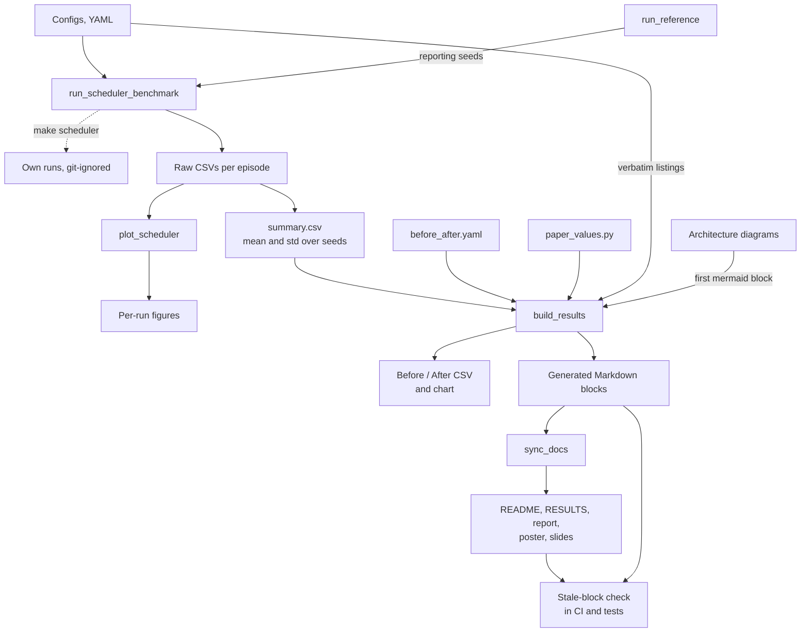

```mermaid
flowchart TD
    Cfg["Configs, YAML"]
    Ref["run_reference"]
    RunS["run_scheduler_benchmark"]
    Own["Own runs, git-ignored"]
    Raw["Raw CSVs per episode"]
    Summary["summary.csv<br/>mean and std over seeds"]
    Plot["plot_scheduler"]
    Figs["Per-run figures"]
    BACfg["before_after.yaml"]
    Paper["paper_values.py"]
    Arch["Architecture diagrams"]
    Build["build_results"]
    BAOut["Before / After CSV<br/>and chart"]
    Gen["Generated Markdown blocks"]
    Sync["sync_docs"]
    Docs["README, RESULTS, report,<br/>poster, slides"]
    Check["Stale-block check<br/>in CI and tests"]

    Cfg --> RunS
    Ref -->|"reporting seeds"| RunS
    RunS -.->|"make scheduler"| Own
    RunS --> Raw
    Raw --> Summary
    Raw --> Plot
    Plot --> Figs
    Summary --> Build
    BACfg --> Build
    Paper --> Build
    Cfg -->|"verbatim listings"| Build
    Arch -->|"first mermaid block"| Build
    Build --> BAOut
    Build --> Gen
    Gen --> Sync
    Sync --> Docs
    Docs --> Check
    Gen --> Check
```
