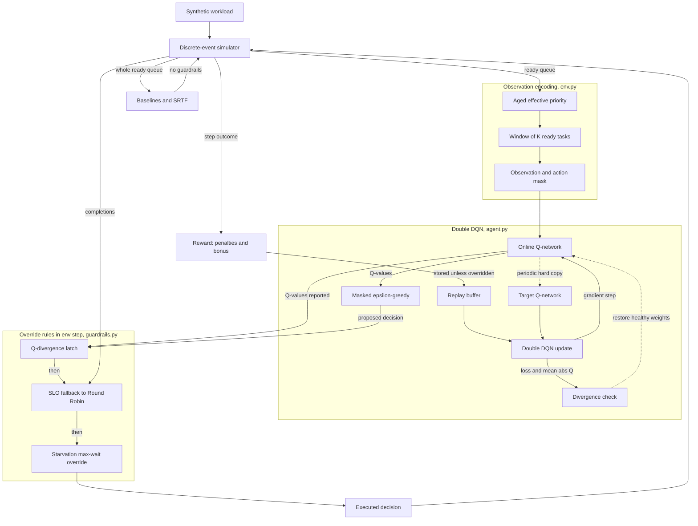

```mermaid
flowchart TD
    Workload["Synthetic workload"]
    Sim["Discrete-event simulator"]

    subgraph ENC["Observation encoding, env.py"]
        Aging["Aged effective priority"]
        Window["Window of K ready tasks"]
        Obs["Observation and action mask"]
    end

    subgraph DDQN["Double DQN, agent.py"]
        Online["Online Q-network"]
        Target["Target Q-network"]
        Eps["Masked epsilon-greedy"]
        Replay["Replay buffer"]
        Update["Double DQN update"]
        Diverge["Divergence check"]
    end

    subgraph GUARD["Override rules in env step, guardrails.py"]
        QDiv["Q-divergence latch"]
        SLO["SLO fallback to Round Robin"]
        Starve["Starvation max-wait override"]
    end

    Exec["Executed decision"]
    Reward["Reward: penalties and bonus"]
    Base["Baselines and SRTF"]

    Workload --> Sim
    Sim -->|"ready queue"| Aging
    Aging --> Window
    Window --> Obs
    Obs --> Online
    Online -->|"Q-values"| Eps
    Online -->|"Q-values reported"| QDiv
    Eps -->|"proposed decision"| QDiv
    QDiv -->|"then"| SLO
    SLO -->|"then"| Starve
    Starve --> Exec
    Exec --> Sim
    Sim -->|"step outcome"| Reward
    Sim -->|"completions"| SLO
    Reward -->|"stored unless overridden"| Replay
    Replay --> Update
    Target --> Update
    Update -->|"gradient step"| Online
    Online -.->|"periodic hard copy"| Target
    Update -->|"loss and mean abs Q"| Diverge
    Diverge -.->|"restore healthy weights"| Online
    Sim -->|"whole ready queue"| Base
    Base -->|"no guardrails"| Sim
```
