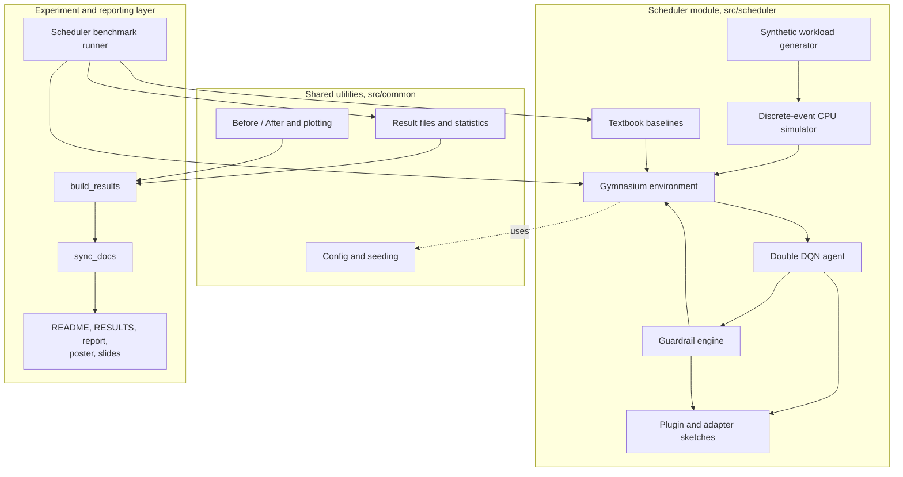

```mermaid
flowchart TB
    subgraph SCHED["Scheduler module, src/scheduler"]
        Workload["Synthetic workload generator"]
        Sim["Discrete-event CPU simulator"]
        Env["Gymnasium environment"]
        Agent["Double DQN agent"]
        Guard["Guardrail engine"]
        SBase["Textbook baselines"]
        Plugin["Plugin and adapter sketches"]
    end

    subgraph COMMON["Shared utilities, src/common"]
        Cfg["Config and seeding"]
        IO["Result files and statistics"]
        BA["Before / After and plotting"]
    end

    subgraph EXP["Experiment and reporting layer"]
        RunS["Scheduler benchmark runner"]
        Build["build_results"]
        Sync["sync_docs"]
        Docs["README, RESULTS, report,<br/>poster, slides"]
    end

    Workload --> Sim
    Sim --> Env
    Env --> Agent
    Agent --> Guard
    Guard --> Env
    SBase --> Env
    Agent --> Plugin
    Guard --> Plugin

    RunS --> Env
    RunS --> SBase
    RunS --> IO
    Env -.->|"uses"| Cfg
    IO --> Build
    BA --> Build
    Build --> Sync
    Sync --> Docs
```
